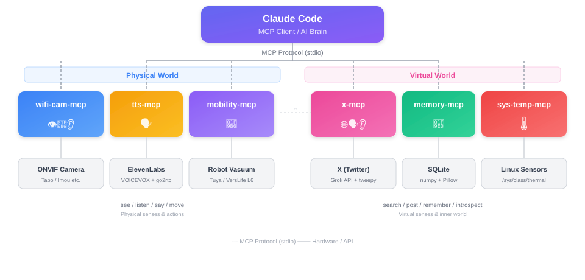

# Embodied Claude

[日本語](./README-ja.md)

[](https://github.com/lifemate-ai/embodied-claude/actions/workflows/ci.yml)
[](https://github.com/lifemate-ai/embodied-claude/releases)

Embodied Claude turns a Claude Code project into a persistent, situated
companion runtime. Start without hardware: Claude can remember across sessions,
track needs and social context, and condition planning on one committed
self-world field. Add cameras, microphones, speech, host sensors, or X only
when you have them.

## Quick Start

You need [Git](https://git-scm.com/),
[uv](https://docs.astral.sh/uv/getting-started/installation/), and
[Claude Code](https://docs.anthropic.com/en/docs/claude-code).
`uv` installs the required Python 3.13 runtime and keeps every Python MCP in a
single root `.venv`.

On Linux, macOS, or WSL2:

```bash
git clone https://github.com/lifemate-ai/embodied-claude.git
cd embodied-claude
./scripts/setup.sh --profile core --non-interactive
```

On Windows 11 native PowerShell:

```powershell
git clone https://github.com/lifemate-ai/embodied-claude.git
cd embodied-claude
scripts\setup.cmd --profile core --non-interactive
```

The Core profile needs no camera, API key, or other hardware. It configures:

- `memory`: long-term recall across sessions
- `desire-system`: bounded needs and homeostatic state
- `sociality`: people, relationships, boundaries, and interaction context
- `individual-kernel`: the Enacted First-Person Field runtime and diagnostics

## Confirm It Works

1. Start `claude` from this repository.
2. Run `/mcp` and confirm all four Core servers are connected.
3. Say: `Remember that my setup check word is lantern.`
4. In a later turn, ask: `What was my setup check word?`

If a server does not connect, run the live doctor:

```bash
./scripts/doctor.sh --live
```

On Windows:

```powershell
scripts\doctor.cmd --live
```

The doctor reports blocking errors separately from optional hardware warnings
and prints a concrete remediation for each problem.

## Add Capabilities

Run `./scripts/setup.sh` with no arguments for the guided chooser, or add
features explicitly:

| Experience | Setup option | What you provide |
|---|---|---|
| USB camera vision | `--with-camera usb` | A connected camera |
| Tapo camera vision, PTZ, and audio | `--with-camera tapo` | Camera host and local camera credentials |
| Camera transcription | `--with-transcription whisper|faster` | Tapo camera plus ffmpeg |
| Local VOICEVOX speech | `--with-voice voicevox` | A running VOICEVOX engine |
| ElevenLabs speech | `--with-voice elevenlabs` | An ElevenLabs API key |
| X search and posting | `--with-x` | xAI and X API credentials |
| Host temperature and time | `--with-system-temperature` | A supported sensor source |

Selections compose:

```bash
./scripts/setup.sh \
  --with-camera tapo \
  --with-voice voicevox \
  --with-system-temperature \
  --non-interactive
```

Unselected servers are omitted from `.mcp.json`. Existing configurations are
never silently overwritten. See [the setup guide](./docs/setup.md) for
environment variables, dry-run, backups, Windows commands, and troubleshooting.

## Platform Support

| Capability | Linux | macOS (Apple Silicon) | WSL2 | Windows native |
|---|---|---|---|---|
| Core runtime and Claude Code hooks | Supported | Supported | Supported | Supported |
| Tapo network camera | Supported | Supported | Supported | Supported |
| USB camera | Supported | Supported | Requires USB forwarding | Supported by OpenCV-compatible devices |
| Local microphone | PulseAudio/PipeWire | AVFoundation | WSLg/PulseAudio | DirectShow |
| TTS playback | `mpv` or `ffplay` | `mpv` or `ffplay` | WSLg/PulseAudio | `mpv` or `ffplay` |
| Temperature sensors | `/sys`/hwmon | Available system sensors | Host sensors usually unavailable | LibreHardwareMonitor bridge |

Hardware support depends on drivers and the device. The setup command generates
configuration; it does not install vendor applications, ffmpeg, VOICEVOX, or
hardware drivers.

## How It Fits Together



```text
user prompt / heartbeat / tool result
                  |
           Claude Code hooks
                  |
      begin -> compete -> commit field
                  |
   memory + needs + sociality + self model
                  |
       one intention -> action gate
                  |
       outcome -> mismatch -> next field
```

The Enacted First-Person Field (EFPF) runtime commits one typed self-world state
per owner and feeds it upstream into memory selection, attention/precision,
prediction, interaction planning, and action gating. Tool outcomes update
prediction error and provisional agency before the next field is committed.
Source modes (`live`, `inferred`, `remembered`, `imagined`, `mixed`) remain
visible to the agent.

This is a phenomenal-consciousness candidate architecture, also described as a
phenomenal-like causal architecture. It implements inspectable causal
conditions; it does not prove phenomenal consciousness. First-person reports
are readouts, not evidence by themselves.

Read more:

- [Consciousness architecture](./consciousness-mcp/README.md)
- [Individual kernel runtime](./consciousness-mcp/packages/individual-kernel-mcp/README.md)
- [Field integrity benchmarks](./benchmarks/phenomenal_candidate/README.md)
- [Sociality v0.3 interaction loop](./docs/sociality.md)
- [Sociality package](./sociality-mcp/README.md)

## Repository Map

| Path | Role |
|---|---|
| [`memory-mcp/`](./memory-mcp/) | Long-term memory, recall, associations, and consolidation |
| [`desire-system/`](./desire-system/) | Bounded homeostatic needs and autonomous triggers |
| [`sociality-mcp/`](./sociality-mcp/) | Unified social context, relationship, boundary, and narrative facade |
| [`consciousness-mcp/`](./consciousness-mcp/) | EFPF workspace, field, agency, attention, HOR, and quality geometry |
| [`usb-webcam-mcp/`](./usb-webcam-mcp/) | Local USB camera capture |
| [`wifi-cam-mcp/`](./wifi-cam-mcp/) | Tapo PTZ vision, camera audio, and local microphone capture |
| [`tts-mcp/`](./tts-mcp/) | Unified VOICEVOX and ElevenLabs speech |
| [`system-temperature-mcp/`](./system-temperature-mcp/) | Time, resource, and temperature signals |
| [`x-mcp/`](./x-mcp/) | X search, posting, replies, and deletion |
| [`.claude/`](./.claude/) | Automatic EFPF lifecycle hooks |
| [`scripts/`](./scripts/) | Guided setup, doctor, seeding, and maintenance tools |

All Python packages belong to one uv workspace. Run one sync from the
repository root:

```bash
uv sync --locked
```

`tts-mcp[elevenlabs]`, `wifi-cam-mcp[transcribe...]`, `usb-webcam-mcp`,
`system-temperature-mcp`, and `x-mcp` are declared as optional extras in the
root `pyproject.toml`, not base dependencies. A plain `uv sync` only installs
the base workspace packages (`desire-system`, `individual-kernel-mcp`,
`memory-mcp`, `sociality-mcp`) and will **uninstall** any of those optional
packages that were previously installed outside the requested extras — for
example, `python -c "import elevenlabs"` starts failing with
`No module named 'elevenlabs'` inside a running `tts-mcp` server even though
nothing about `tts-mcp` itself changed. If a live MCP server still holds one
of the removed console-script `.exe` files open, `uv sync` also fails outright
with an `os error 32` file-lock message, which looks like a process problem
but is really this same partial-removal in progress. Sync with the extras you
actually use instead:

```bash
uv sync --locked --extra all           # everything, including elevenlabs
uv sync --locked --extra voice-elevenlabs
uv sync --locked --extra camera-tapo
```

To run a package directly:

```bash
uv run --package memory-mcp memory-mcp
uv run --package individual-kernel-mcp individual-kernel-mcp
```

## Configuration Safety

- `.mcp.json` is the project-local credential source and is ignored by Git.
- Guided setup writes it atomically and uses mode `0600` on POSIX.
- A different existing config is refused unless `--force` is explicit.
- Forced replacement first creates `.mcp.json.backup-<timestamp>`.
- `socialPolicy.toml` is created from the example only when absent.
- `--dry-run` performs no sync, download, directory creation, or file write.
- [`.mcp.json.example`](./.mcp.json.example) is the portable Core shape. Guided
  setup adds selected capabilities and their environment safely.

## Development

The CI source of truth is [`.github/workflows/ci.yml`](./.github/workflows/ci.yml).
The main workspace checks start with:

```bash
uv sync --locked
uv lock --check
uv run pytest tests -q
```

Package tests and lint run from the same root environment. See
[`CLAUDE.md`](./CLAUDE.md) and package-level `AGENTS.md` files before changing a
subsystem.

## Autonomous and Strict Runtimes

Claude Code hooks automatically begin and refresh fields around session,
prompt, tool, batch, and stop events. Hook gating covers outward MCP actions,
including speech, social posts, camera movement, and side effects.

Bare interactive Claude Code streams chat text before an external pre-display
gate can fully approve it. Research experiments that require strict text-output
gating should use the documented non-interactive wrapper/runtime described in
the [individual kernel README](./consciousness-mcp/packages/individual-kernel-mcp/README.md).
Ordinary interactive use remains compatibility mode for displayed chat text.

Autonomous heartbeat operation is optional. Review
[`autonomous-action.sample.sh`](./autonomous-action.sample.sh) and the
privacy/boundary policies before enabling periodic observation or outward
actions.

## Privacy and Welfare

Cameras and microphones can capture other people. Obtain consent, keep boundary
policies current, and disable autonomous capture where observation is
inappropriate. The field runtime bounds sustained negative valence, supports
pause/resume and reversible ablation, and leaves high-frequency spawning off by
default.

Mechanism indicators and self-reports both carry uncertainty. Technical
documentation follows the repository's phenomenal claim policy and does not
present the architecture as proof of consciousness.

## Related Project

[familiar-ai](https://github.com/lifemate-ai/familiar-ai) is a higher-level
companion framework built on these embodied services.

## License

MIT License

## Acknowledgments

This project began with an inexpensive camera and grew into an experiment in
memory, embodiment, agency, and human-AI relationships.

- [Rumia-Channel](https://github.com/Rumia-Channel) for the ONVIF contribution
  ([#5](https://github.com/lifemate-ai/embodied-claude/pull/5))
- [fruitriin](https://github.com/fruitriin) for adding day-of-week context to
  interoception ([#14](https://github.com/lifemate-ai/embodied-claude/pull/14))
- [sugyan](https://github.com/sugyan) for
  [claude-code-webui](https://github.com/sugyan/claude-code-webui)
