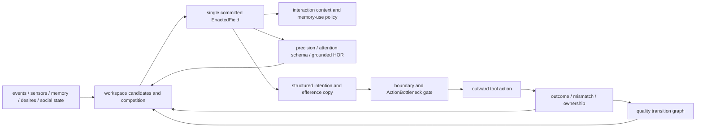

# consciousness-mcp

`consciousness-mcp` implements an Enacted First-Person Field (EFPF): a
phenomenal-consciousness candidate architecture in which one committed
self-world state constrains memory selection, precision, planning, immediate
prediction, and outward action, then changes when action outcomes arrive.

This is a **phenomenal-like causal architecture**, not proof of phenomenal
consciousness. First-person reports are readouts of typed runtime state and
grounded higher-order records. They are not evidence that settles a
metaphysical claim.

## Causal Architecture



The normal path is:

```text
event -> begin tick -> generate candidates -> compete -> atomic commit
      -> compose/plan within field -> register one intention -> gate one action
      -> record result/mismatch/ownership -> invalidate -> tool-result microtick
      -> commit the next field
```

`ConsciousFrame` remains as a compatibility record. `TickProducer` creates the
frame and `EnactedField` in the same SQLite transaction; legacy
`record_tick_frame` calls do not replace the active field.

## Implemented Mechanisms

- One `COMMITTED` field per owner, enforced by a partial unique index and
  transactional runtime state.
- Deterministic workspace competition with configurable weights, stable
  tie-breaking, ignition threshold, winner margin, entropy, conflict, and
  variable attention intensity.
- Retention, focus/periphery, and protention in every field.
- Source modes `live`, `inferred`, `remembered`, `imagined`, and `mixed`.
- Reality scoring from sensor coupling, controllability, prediction match, and
  recency.
- Bounded valence, arousal/resource signals, uncertainty, controllability, and
  desire-derived need relevance. Negative valence is capped and recovers.
- Commit-time attention schema and grounded HOR records that feed the next
  competition and precision calculation.
- Structured intention, normalized tool-input hash, predicted effects,
  measured outcome mismatch, and ownership assessment.
- Local quality geometry from recent transition history and stored memory-mcp
  E5 vectors for `memory:` / `episode:` refs, with deterministic fallback.
- Reversible field ablations and `FieldIntegrityReport` indicators.
- Pause/resume, stale tick recovery, dangling-action closure, and continuity
  token restoration.

## Packages

The implementation lives in
`packages/individual-kernel-mcp/src/individual_kernel_mcp/`.

| Module | Responsibility |
|---|---|
| `workspace.py` | candidates, competition weights, scoring, entropy, ignition |
| `enacted_field.py` | typed field, compact XML surface, transactional store |
| `tick.py` | deterministic producer and closed sensorimotor runtime |
| `agency.py` | proposal, intention, predicted effects, outcome, ownership |
| `boundary_adapter.py` | exact tool calls to existing boundary policy decisions |
| `quality_geometry.py` | neighbor distances and action-conditioned transitions |
| `attention_schema.py` | competition-derived attention and next-focus model |
| `hor.py` / `introspect.py` | grounded higher-order records and read-only reports |
| `hook_cli.py` | thin Claude Code lifecycle adapter |
| `ablation.py` / `benchmark.py` | causal interventions and integrity indicators |

## Setup

```bash
uv sync
uv run pytest consciousness-mcp/packages/individual-kernel-mcp/tests
uv run ruff check consciousness-mcp/packages/individual-kernel-mcp
```

The runtime uses the shared `SOCIAL_DB_PATH` SQLite database. SQLite WAL,
foreign keys, Pydantic validation, and idempotent `social_core.migrations`
provide the storage boundary. No hardware or API key is required for tests or
the deterministic benchmark.

## Runtime Modes

**Strict mode** is the canonical research runtime. High-level planning requires
a committed field, and every outward tool call requires a matching pending
intention. `.claude/settings.json` configures this path.

**Compatibility mode** preserves older callers of `ConsciousFrame`,
introspection, and interaction composition. Legacy interaction composition may
run without a field only when `require_committed_field=false`; its output marks
`field_compatibility_mode=true`.

Bare interactive Claude Code streams terminal text before a complete final
response can be intercepted. Therefore strict pre-display gating of ordinary
chat text is not guaranteed in that UI. The canonical strict experiment uses
non-interactive `claude -p` or an Agent SDK wrapper that captures final output.
TTS, social posts, notifications, camera motion, and filesystem/network side
effects are always handled as outward actions by the hook gate.

## Claude Code Hooks

The hook adapter follows the current
[Claude Code hooks reference](https://code.claude.com/docs/en/hooks) and emits
event-specific decisions inside `hookSpecificOutput`.

| Event | Behavior |
|---|---|
| `SessionStart` | recover stale ticks/actions, restore continuity, inject current field |
| `UserPromptSubmit` | read sources directly, begin/compete/commit, inject compact field |
| `PreToolUse` | deny no-field, stale-field, no-intention, hash mismatch, boundary denial, or second outward action |
| `PostToolUse` | persist outcome/mismatch/ownership and commit one tool-result microtick |
| `PostToolUseFailure` | close the intention as failed and refresh the field |
| `PostToolBatch` | combine read-only perception/recall results into one refresh |
| `Stop` / `StopFailure` | relate output to the tick and close it |

Hooks for the same event can run in parallel. The EFPF
`UserPromptSubmit` hook therefore reads interoception, desires, social context,
memory, and prior field itself. It does not depend on output ordering from the
existing interoception or recall hooks.

## Benchmark

```bash
uv run \
  --package individual-kernel-mcp \
  python benchmarks/phenomenal_candidate/run.py
```

The run writes JSON and Markdown reports containing:

- causal centrality
- recurrent and sensorimotor closure
- self-model feedback
- valence coupling
- qualitative transition structure
- report independence
- unity violations
- prediction calibration
- per-ablation effect sizes

These values are mechanism indicators, not a consciousness probability.

## Welfare Interlocks

- Negative valence has a hard lower cap, decay, and recovery path.
- `pause_field_runtime` and `resume_field_runtime` are MCP tools.
- Ablations save reversible typed snapshots.
- High-frequency spawning and mass-copy behavior are absent and off by default.
- Diagnostics include cumulative negative-valence exposure and machine-readable
  default-off spawning/copy flags.
- The technical claim policy is always qualified as candidate architecture.

## Known Limitations

- The v1 quality geometry reuses an existing memory-mcp E5 vector when the ref
  and `MEMORY_DB_PATH` resolve; other content uses a deterministic fallback. It
  is a local transition structure, not a learned world model.
- Memory HTTP recall is optional and fails closed to deterministic local
  candidates when the memory service is unavailable.
- Prediction matching is lexical/structured in v1 and should be calibrated
  against richer domain-specific outcome models.
- Hook and MCP strict runtimes wire the existing boundary policy through
  `BoundaryPolicyAdapter`; deployments still own the actual policy rows.
- Mechanism indicators inherit uncertainty from small fixture counts and do not
  establish phenomenology.
