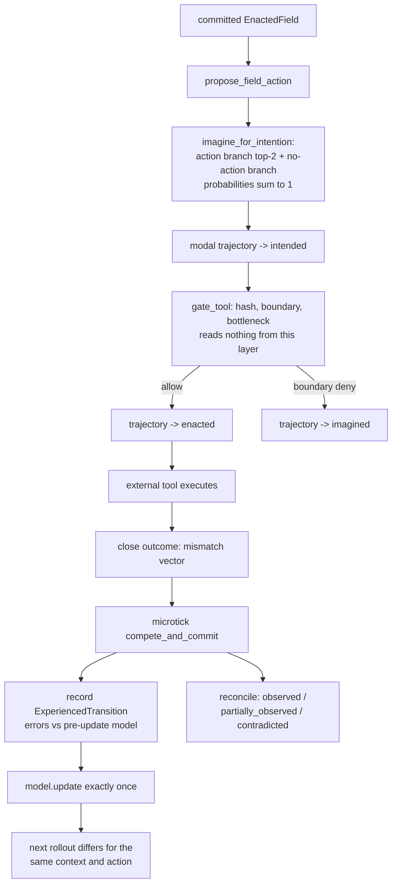

# GenerativeFieldModel Design (count_v1)

Status: first vertical slice shipped 2026-07-26 on the
`feat/generative-field-model` branch. Scope: prediction and learning only.
Action selection, workspace competition, the `<current_field>` surface, and
the boundary gate are byte-identical with the flag on or off.

Claim policy: this layer records and predicts functional state transitions.
Nothing in it is a phenomenal claim.

## Goal

Upgrade the EFPF from a state snapshot to a dynamical-system state:

```
committed field -> imagine >=2 action-conditioned trajectories (incl. no-action)
-> one is linked to the registered intention -> the action executes
-> the result is observed -> component prediction errors are computed
-> one ExperiencedTransition is recorded -> the model updates exactly once
-> the next rollout for the same (context, action) is measurably different
```

## Data model (migration `009_generative_field_model`)

- `protention_distributions` - one row per propose-time rollout set
  (entropy, model version, trajectory count).
- `imagined_trajectories` - persisted rollouts. Status lifecycle is the only
  mutable part: `imagined -> intended -> enacted -> observed | contradicted |
  partially_observed`, plus `intended -> imagined` when the boundary denies or
  the intention expires unexecuted, and a reserved `expired` state for the
  future protention-expiry daemon. Probabilities and steps are immutable after
  insert; every transition is appended to `status_history`. Imagined records
  never auto-promote.
- `experienced_transitions` - one row per arrived-at field, action-attributed
  or `no_action`. Carries observed external/internal/social snapshots,
  per-component prediction errors, valence/arousal before/after, agency and
  ownership confidence, `source_mode` restricted to live/inferred/mixed, and
  `knowledge_source` fixed to `experienced` in v1 (told/imagined/replayed are
  reserved for the fork experiments, together with `info_content_hash`,
  `fork_id`, pose refs, `body_delta_json`, `process_meta_ref`, and
  `allostatic_snapshot_json`, which exist now so later phases need no
  re-migration). `next_field_id` is UNIQUE: recording is idempotent.
- `generative_transition_stats` - Dirichlet count table keyed by the six
  context features plus the outcome bucket. `observation_count` is REAL so the
  future organism daemon can decay counts fractionally.
- `prediction_resolutions` - one row per scored (trajectory, step); unique per
  pair, so calibration passes are idempotent. v1 resolves step 1; deeper steps
  reuse the same table later.

Learning is exactly-once: `model.update` first claims the transition via
`UPDATE ... SET applied_at = ? WHERE applied_at IS NULL` and only counts it
when the claim succeeds, which is safe across hook subprocesses.

## Context and outcome discretization

The count model deliberately predicts at kind level, not exact refs (the
dormant `QualityGeometry.predict_transition` shows exact refs never repeat).

- `ContextSignature`: `focus_kind | trigger_kind | dominant_desire |
  valence_bucket(neg/neu/pos, +-0.15 deadband) | arousal_bucket(low/mid/high)
  | action_kind(tool:<name> or no_action)`.
- Outcome bucket: `{ok|fail|na}/{short|mid|long|na}/{next_focus_kind}/{-|=|+}`
  (latency <1s/<10s; valence delta +-0.05 deadband).
- Inference: Dirichlet smoothing `P=(n+a)/(N+aK)` with `a=0.5` and
  `K = observed buckets + 1` (a novel bucket); step uncertainty `aK/(N+aK)`.
- Nearest-neighbor fallback is a deterministic backoff chain (drop
  dominant_desire, then arousal, then valence, then everything but
  action_kind, then a fixed uniform prior). The level used is recorded in
  `TrajectoryStep.basis`. No RNG anywhere.
- Rollout supports horizon 1..5: step 1 conditions on the action, later steps
  on `no_action`, chaining the imagined context. Sparse data pushes deep steps
  onto backoff/prior levels so their uncertainty honestly approaches 1.

Implementation note: `TrajectoryStep` lives in `generative_model.py` (it is a
prediction product) and `trajectory.py` imports it; this keeps the module
graph acyclic.

## Runtime integration (flag-guarded, exception-tolerant)



Integration points: `TickProducer.compete_and_commit` (single learning choke
point, inside the commit transaction, wrapped so a prediction fault can never
abort a commit), `FieldRuntime.propose_action` (rollout + trace ref),
`gate_tool` (status advance/return after the unchanged gate decision), and
`close_tool`/`close_action` (reconciliation after the microtick). Action
branch weight is `intention.confidence`; the no-action branch gets the
remainder, so the distribution honestly models "the proposed action may not
execute". Hooks and `.claude/settings.json` are unchanged; all learned state
lives in SQLite because each hook is a fresh subprocess.

## Configuration

`mcpBehavior.toml` (re-read on every call, so live toggling works):

```toml
[individual-kernel]
generative_field_model = true      # default on; writes are additive-only
generative_rollout_horizon = 2     # 1..5
```

## Measurement

`calibration.py` scores step-1 predictions against observed transitions:
Brier, log loss, ECE (10 bins), top-1, per-component MAE, always next to
persistence and uniform baselines, with a 20-sample reliability floor.
`IndicatorProfile.prediction_calibration` becomes `1 - Brier` once enough
resolutions exist and falls back to the legacy binary `prediction_match`
otherwise (`prediction_calibration_detail` records which source produced the
headline number). The benchmark writes `prediction-calibration.{json,md}`
next to the indicator profile, and `run.py --check` fails if either mandated
report is missing.

MCP inspection surface: `rollout_protention`, `query_imagined_trajectories`,
`query_experienced_transitions`, `get_generative_model_calibration`.

## How later phases extend this layer

- Allostatic valence: replace the desire-file EMA with
  `AllostaticVariable`-based valence; `allostatic_snapshot_json` and the
  arousal columns on transitions are already in place, and
  `sum_valence_delta` in the stats feeds expected-improvement estimates.
- Valence coupling: per-tick competition weights recorded in the epistemic
  trace; the model's learning rate can be modulated per update.
- BodyContingency: `pose_before_ref`/`pose_after_ref`/`body_delta_json` on
  transitions take measured actuator deltas (e.g. the camera's ONVIF pose
  readback) and replace the success-flag `exclusive_causal_fit` stub with a
  reafference comparison.
- Process-level HOR: `process_meta_ref` links transitions to
  ProcessMetaRepresentation records; calibration errors feed precision
  adjustments.
- Experienced/told/imagined forks: forks are separate SQLite copies (several
  kernel read paths are not owner-filtered, so owner namespacing would leak
  evidence); `knowledge_source`, `info_content_hash`, and `fork_id` already
  exist, and the `ExperiencedTransition` validator is the single place that
  widens from `experienced`-only.
- Organism daemon: fractional decay of `observation_count`, protention expiry
  via `expires_at`/`expired`, and batch resolution of deeper steps, all
  without an LLM in the loop.
