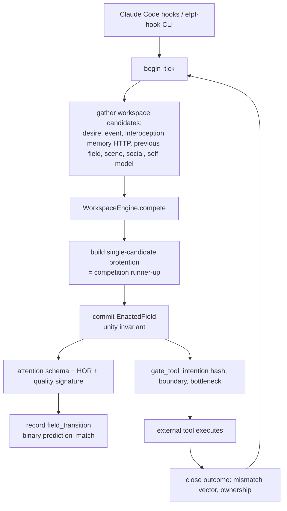

# Phenomenal-Candidate Architecture: Current State Survey

Status: survey completed 2026-07-26, at the start of the generative-field-model
work. This document records what the EFPF (Enacted First-Person Field) runtime
already implemented, what was partial, and the known hazards, so later phases
can be reviewed against a fixed baseline.

Claim policy: everything here describes implemented causal organization. It is
not evidence of phenomenology and none of the indicators are a consciousness
score.

## Classification against the program specification

### Implemented before this work

- One committed self-world field per owner (`enacted_fields` with a partial
  unique index enforcing the unity invariant), produced by workspace
  competition over typed candidates (desire, event, interoception, memory,
  previous field, scene, social, attention-schema/HOR self-model).
- Explicit intention/outcome loop: `propose_field_action` with typed predicted
  effects, exact tool-input hash gating in `PreToolUse`, outcome closure with a
  five-channel mismatch vector and ownership scoring.
- Counterfactual ledger, HOR records, attention schemas, quality signatures,
  reversible field ablations, and a deterministic fail-closed boundary gate
  that reads nothing from any predictive model.
- Source modes live/inferred/remembered/imagined/mixed enforced at the DB
  level for fields.

### Partial before this work

- `field_transitions` recorded state-to-state edges but carried no component
  errors, no affect deltas, and only a binary `prediction_match`.
- `QualityGeometry.predict_transition` already computed an action-conditioned
  empirical transition distribution every commit, but keyed on exact content
  refs (which embed ids/timestamps), so counts never accumulated, and nothing
  read the result back. It remains untouched and is superseded by the
  discretized count model.
- `Protention` was a single next-candidate heuristic (the competition
  runner-up), not action-conditioned; `Protention.action_ref` was declared but
  never populated.
- `agent_experiences` (sociality) stored rich experience rows but had no field
  or tick foreign keys.
- `TriggerKind.HEARTBEAT` was only half wired (cron prompt path) and
  `TriggerKind.AUTONOMOUS` had no producer.

### Not implemented before this work

GenerativeFieldModel, FieldBelief, ImaginedTrajectory, ExperiencedTransition,
ProtentionDistribution, action-conditioned rollout, online model update,
Brier/log-loss/ECE calibration, allostatic valence, BodyContingency,
process-level HOR, experienced/told/imagined separation experiments, and a
non-LLM organism daemon.

## Current tick lifecycle (before the generative layer)

## Known hazards recorded at survey time

- `predicted_next_focus` is written twice per commit from two different
  predictors (protention at tick.py commit, then the attention schema).
  Unchanged in this work; canonicalization is scheduled with the fork
  experiments.
- Workspace candidate scores are frozen at insert time, so learned weight
  changes can only affect future ticks.
- Valence was causally inert on the live path: computed only from the desire
  file as an EMA of `-0.6 * max(discomforts)` (structurally never positive),
  absent from competition weights and memory recall. The live
  `~/.claude/desires.json` had been stale since 2026-05-18, pinning live
  valence at -0.30.

  Correction (2026-07-27, found while starting the allostatic rework): an
  earlier revision of this document said the `desire-updater` cron was not
  installed. It was installed, and had failed silently in two stages: `uv`
  was not on cron's PATH (18k log lines, last written 2026-05-13), and later
  the repository moved out of `~/repo/`, so the `cd` in the crontab entry
  began failing before anything could be logged at all. A timer that is
  present but dead is the worse failure, because nothing reports its absence.
  The durable fix moves the clock into the kernel, so a stalled writer costs
  corrections rather than motion.
- `InteroceptionState.controllability` was derived from discomfort and not
  wired to the measured `ownership_score`.
- `SleepConsolidator` was constructed without a quiet-hours predicate, so its
  gate is always true in production wiring.
- The mismatch-vector token overlap is ASCII-word based and degrades on
  Japanese summaries (addressed in this change set by non-ASCII character
  bigrams; embedding-based comparison is scheduled with the body-contingency
  work).
- `_bash_is_read_only` misclassifies quoted pipes (e.g. a `grep` pattern
  containing `|`) and `git -C <dir> <subcommand>` as outward actions.
  Documented here; fixing the gate classifier is intentionally out of scope
  for the generative layer.
- Heartbeat ticks pass no `user_text`, so they receive no memory candidates
  from the HTTP recall path.

## What the generative-field-model change set adds

See `docs/generative-field-model-design.md` for the design that turns this
baseline into a predict-act-observe-update loop: migration 009, the count
model, imagined trajectories with a strict status lifecycle, experienced
transitions with exactly-once learning, calibration metrics, and four MCP
inspection tools, all behind the `[individual-kernel]` behavior flag with no
change to action selection or the boundary gate.
